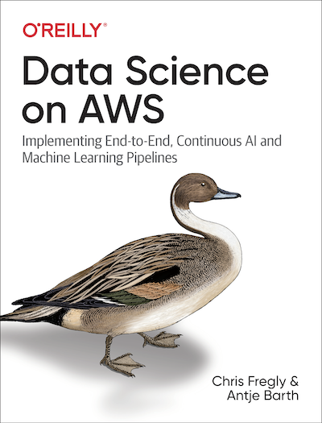
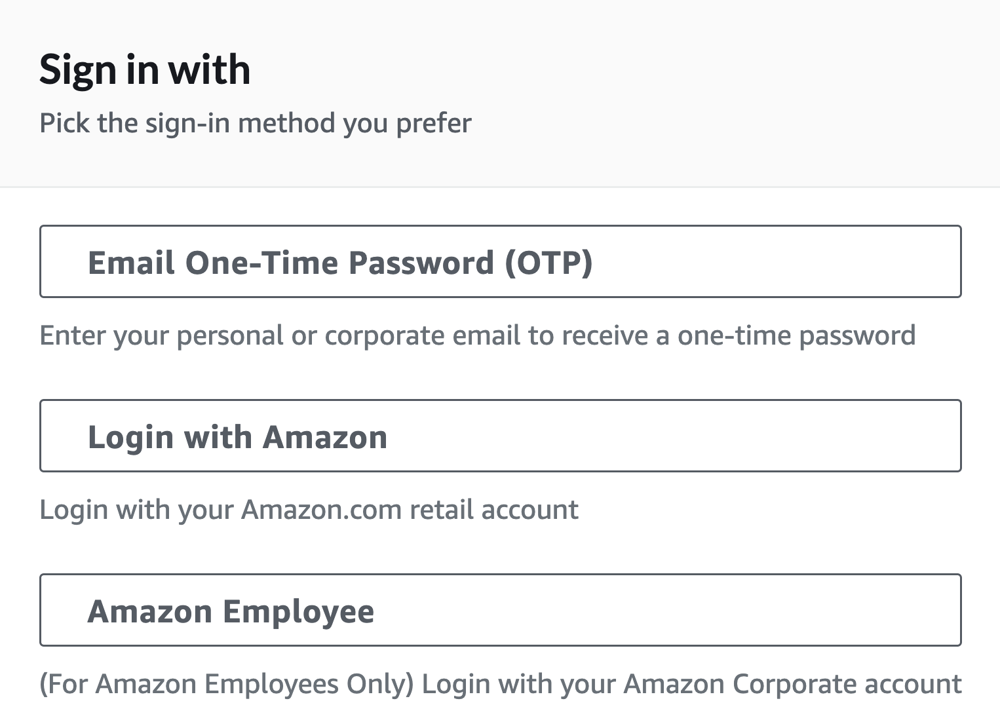
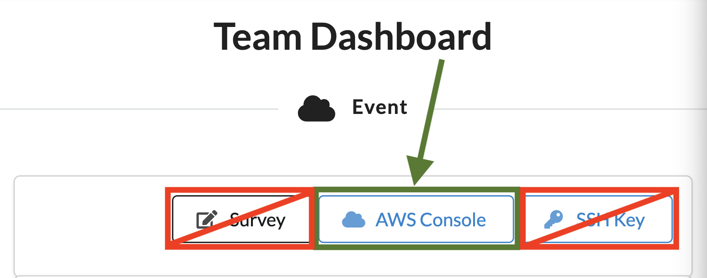
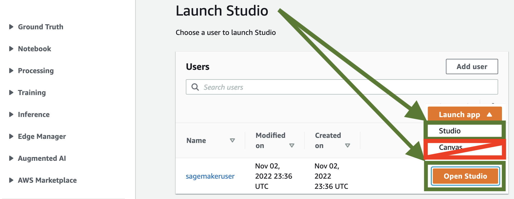

# Data Science on AWS Workshop

Based on this O'Reilly book:  

[](https://www.amazon.com/Data-Science-AWS-End-End/dp/1492079391/)


## Workshop Description
In this hands-on workshop, we will build an end-to-end AI/ML pipeline for natural language processing with Amazon SageMaker.  We will train and tune a text classifier to classify text-based product reviews using the state-of-the-art [BERT](https://arxiv.org/abs/1810.04805) model for language representation.

To build our BERT-based NLP model, we use the [Amazon Customer Reviews Dataset](https://s3.amazonaws.com/amazon-reviews-pds/readme.html) which contains 150+ million customer reviews from Amazon.com for the 20 year period between 1995 and 2015.  In particular, we train a classifier to predict the `star_rating` (1 is bad, 5 is good) from the `review_body` (free-form review text).

You will get hands-on with advanced model training and deployment techniques such as hyper-parameter tuning, A/B testing, and auto-scaling.  You will also setup a real-time, streaming analytics and data science pipeline to perform window-based aggregations and anomaly detection.

Attendees will learn how to do the following:
* Ingest data into S3 using Amazon Athena and the Parquet data format
* Visualize data with pandas, matplotlib on SageMaker notebooks
* Perform feature engineering on a raw dataset using Scikit-Learn and SageMaker Processing Jobs
* Store and share features using SageMaker Feature Store
* Train and evaluate a custom BERT model using TensorFlow, Keras, and SageMaker Training Jobs
* Evaluate the model using SageMaker Processing Jobs
* Track model artifacts using Amazon SageMaker ML Lineage Tracking
* Register and version models using SageMaker Model Registry
* Deploy a model to a REST endpoint using SageMaker Hosting and SageMaker Endpoints
* Automate ML workflow steps by building end-to-end model pipelines
* Perform automated machine learning (AutoML) to find the best model from just your dataset with low-code
* Find the best hyper-parameters for your custom model using SageMaker Hyper-parameter Tuning Jobs
* Deploy multiple model variants into a live, production A/B test to compare online performance, live-shift prediction traffic, and autoscale the winning variant using SageMaker Hosting and SageMaker Endpoints
* Setup a streaming analytics and continuous machine learning application using Amazon Kinesis and SageMaker


## Workshop Instructions
_Note:  This workshop will create an ephemeral AWS acccount for each attendee.  This ephemeral account is not accessible after the workshop.  You can, of course, clone this GitHub repo and reproduce the entire workshop in your own AWS Account._


### 0. Logout of All AWS Consoles Across All Browser Tabs
If you do not logout of existing AWS Consoles, things will not work properly.


_Please logout of all AWS Console sessions in all browser tabs._


### 1. Login to the Workshop Portal (aka Event Engine). 







### 2. Login to the **AWS Console**


Take the defaults and click on **Open AWS Console**. This will open AWS Console in a new browser tab.

If you see this message, you need to logout from any previously used AWS accounts.


_Please logout of all AWS Console sessions in all browser tabs._

Double-check that your account name is similar to `TeamRole/MasterKey` as follows:


If not, please logout of your AWS Console in all browser tabs and re-run the steps above!


### 3. Launch SageMaker Studio

Open the [AWS Management Console](https://console.aws.amazon.com/console/home)


In the AWS Console search bar, type `SageMaker` and select `Amazon SageMaker` to open the service console.





### 4. Launch a New Terminal within Studio

Click `File` > `New` > `Terminal` to launch a terminal in your Jupyter instance.


### 5. Clone this GitHub Repo in the Terminal

Within the Terminal, run the following:

```
cd ~ && git clone -b quickstart https://github.com/data-science-on-aws/data-science-on-aws
```

If you see an error like the following, just re-run the command again until it works:
```
fatal: Unable to create '.git/index.lock': File exists.

Another git process seems to be running in this repository, e.g.
an editor opened by 'git commit'. Please make sure all processes
are terminated then try again. If it still fails, a git process
may have crashed in this repository earlier:
remove the file manually to continue.
```
_Note:  This is not a fatal error ^^ above ^^.  Just re-run the command again until it works._


### 6. Start the Workshop!

Navigate to the first directory and start the workshop!

_You may need to refresh your browser if you don't see the directories._
