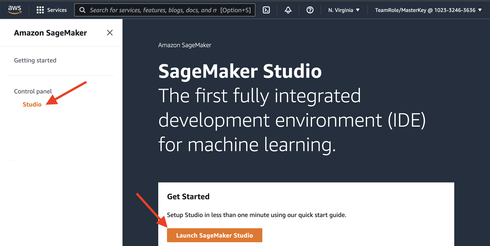

# O'Reilly Book

## Data Science on AWS

YouTube Videos, Meetups, Book, and Code:  **https://datascienceonaws.com**

[](https://datascienceonaws.com)

# Workshop Description
In this hands-on workshop, we will build an end-to-end AI/ML pipeline for natural language processing with Amazon SageMaker.  We will train and tune a text classifier to classify text-based product reviews using the state-of-the-art [BERT](https://arxiv.org/abs/1810.04805) model for language representation.

To build our BERT-based NLP model, we use the [Amazon Customer Reviews Dataset](https://s3.amazonaws.com/amazon-reviews-pds/readme.html) which contains 150+ million customer reviews from Amazon.com for the 20 year period between 1995 and 2015.  In particular, we train a classifier to predict the `star_rating` (1 is bad, 5 is good) from the `review_body` (free-form review text).

# Learning Objectives
Attendees will learn how to do the following:
* Ingest data into S3 using Amazon Athena and the Parquet data format
* Visualize data with pandas, matplotlib on SageMaker notebooks
* Run data bias analysis with SageMaker Clarify
* Perform feature engineering on a raw dataset using Scikit-Learn and SageMaker Processing Jobs
* Store and share features using SageMaker Feature Store
* Train and evaluate a custom BERT model using TensorFlow, Keras, and SageMaker Training Jobs
* Evaluate the model using SageMaker Processing Jobs
* Track model artifacts using Amazon SageMaker ML Lineage Tracking
* Run model bias and explainability analysis with SageMaker Clarify
* Register and version models using SageMaker Model Registry
* Deploy a model to a REST Inference Endpoint using SageMaker Endpoints
* Automate ML workflow steps by building end-to-end model pipelines using SageMaker Pipelines

# Workshop Cost
This workshop is FREE, but would otherwise cost <25 USD.


# Workshop Description


# Workshop Path


# Workshop Instructions

## 1. Setup Environment

Follow these instructions:  http://amzn.to/3lo3KdX


## 2. Launch SageMaker Studio

Open the [AWS Management Console](https://console.aws.amazon.com/console/home)


In the AWS Console search bar, type `SageMaker` and select `Amazon SageMaker` to open the service console.




## 3. Launch a New Terminal within Studio

Click `File` > `New` > `Terminal` to launch a terminal in your Jupyter instance.


## 4. Clone this GitHub Repo in the Terminal

Within the Terminal, run the following:

```
cd ~ && git clone https://github.com/data-science-on-aws/workshop
```

If you see an error like the following, just re-run the command again until it works:
```
fatal: Unable to create '/home/sagemaker-user/workshop/.git/index.lock': File exists.

Another git process seems to be running in this repository, e.g.
an editor opened by 'git commit'. Please make sure all processes
are terminated then try again. If it still fails, a git process
may have crashed in this repository earlier:
remove the file manually to continue.
```
_Note:  This is not a fatal error ^^ above ^^.  Just re-run the command again until it works._


## 5. Start the Workshop!

Navigate to `00_quickstart/` in SageMaker Studio and start the workshop!

_You may need to refresh your browser if you don't see the new `workshop/` directory._


